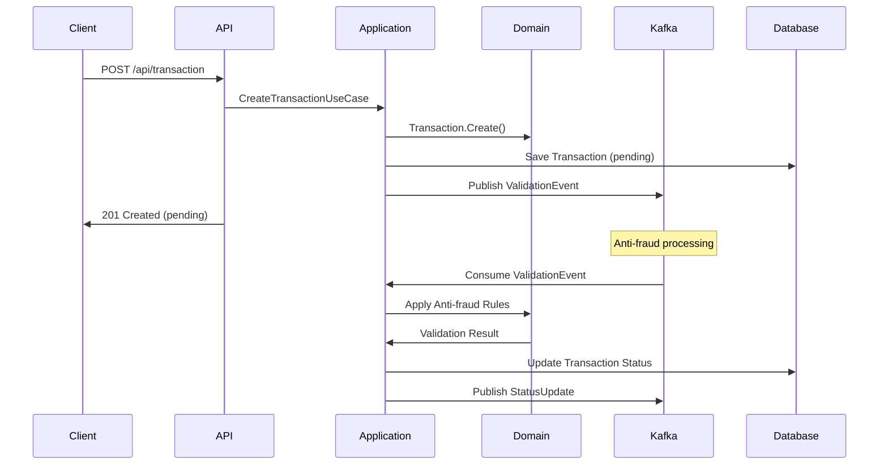

# Antifraud System

> **Anti-fraud validation system for financial transactions**

A microservice developed in .NET 8 that implements anti-fraud validation rules for financial transactions using hexagonal architecture, with asynchronous processing via Kafka and persistence in PostgreSQL.

## 📋 Table of Contents

- [Features](#-features)
- [Architecture](#-architecture)
- [Technologies](#-technologies)
- [Installation](#-installation)
- [Usage](#-usage)
- [API Endpoints](#-api-endpoints)
- [Anti-Fraud Rules](#-anti-fraud-rules)
- [Testing](#-testing)
- [Docker](#-docker)
- [Project Structure](#-project-structure)
- [Contributing](#-contributing)

## ✨ Features

- **🛡️ Anti-Fraud Validation**: Configurable rules for fraudulent transaction detection
- **🏗️ Hexagonal Architecture**: Clear separation between domain, application, and infrastructure
- **⚡ Asynchronous Processing**: Transaction validation through Kafka events
- **📊 Persistence**: Transaction storage in PostgreSQL
- **🐳 Containerization**: Complete deployment with Docker Compose
- **✅ Testing**: Full coverage with unit tests
- **📚 Documentation**: API documented with Swagger/OpenAPI

## 🏛️ Architecture

### Hexagonal Architecture (Ports & Adapters)

```
┌──────────────────────────────────────────────────────────────┐
│                        API Layer                             │
│  ┌─────────────────┐ ┌─────────────────┐ ┌─────────────────┐ │
│  │   Controllers   │ │   Middleware    │ │   Health Check  │ │
│  └─────────────────┘ └─────────────────┘ └─────────────────┘ │
└──────────────────────────────────────────────────────────────┘
                                │
┌──────────────────────────────────────────────────────────────┐
│                   Application Layer                          │
│  ┌─────────────────┐ ┌─────────────────┐ ┌─────────────────┐ │
│  │   Use Cases     │ │    Services     │ │      DTOs       │ │
│  └─────────────────┘ └─────────────────┘ └─────────────────┘ │
└──────────────────────────────────────────────────────────────┘
                                │
┌──────────────────────────────────────────────────────────────┐
│                     Domain Layer                             │
│  ┌─────────────────┐ ┌─────────────────┐ ┌─────────────────┐ │
│  │   Entities      │ │  Value Objects  │ │ Domain Services │ │
│  │                 │ │                 │ │                 │ │
│  │  • Transaction  │ │  • Money        │ │ • Anti-Fraud    │ │
│  │  • Account      │ │  • Status       │ │   Rules         │ │
│  └─────────────────┘ └─────────────────┘ └─────────────────┘ │
└──────────────────────────────────────────────────────────────┘
                                │
┌──────────────────────────────────────────────────────────────┐
│                Infrastructure Layer                          │
│  ┌─────────────────┐ ┌─────────────────┐ ┌─────────────────┐ │
│  │   PostgreSQL    │ │      Kafka      │ │  Repositories   │ │
│  │   (EF Core)     │ │   (Messaging)   │ │   (Data Access) │ │
│  └─────────────────┘ └─────────────────┘ └─────────────────┘ │
└──────────────────────────────────────────────────────────────┘
```

### Processing Flow



## 🛠️ Technologies

### Core
- **.NET 8** - Main framework
- **C# 12** - Programming language
- **ASP.NET Core** - Web API

### Persistence
- **PostgreSQL 14** - Main database
- **Entity Framework Core 8** - ORM
- **Npgsql** - PostgreSQL driver

### Messaging
- **Apache Kafka** - Message broker
- **Confluent.Kafka** - .NET Kafka client

### Testing
- **xUnit** - Testing framework
- **FluentAssertions** - Fluent assertions
- **Moq** - Mocking framework

### DevOps
- **Docker** - Containerization
- **Docker Compose** - Orchestration
- **Swagger/OpenAPI** - API documentation

## 🚀 Installation

### 1. Clone repository
```bash
git clone <repository-url>
cd antifraud
```

### 2. Option A: Local Development

#### Start infrastructure
```bash
docker compose -f docker/docker-compose.yml up -d postgres kafka zookeeper
```

#### Create Kafka topics
```bash
docker exec -it antifraud_kafka_1 kafka-topics \
  --create --topic transaction-validation \
  --bootstrap-server localhost:29092 --partitions 3 --replication-factor 1

docker exec -it antifraud_kafka_1 kafka-topics \
  --create --topic transaction-validation-response \
  --bootstrap-server localhost:29092 --partitions 3 --replication-factor 1
```

#### Run application
```bash
cd src/Antifraud.Api
dotnet restore
dotnet run
```

### 3. Option B: Full Docker

```bash
# Start entire system
docker compose -f docker/docker-compose.yml up -d

# View logs
docker compose -f docker/docker-compose.yml logs -f antifraud-api
```

## 💡 Usage

### Application access
- **API**: http://localhost:5000
- **Swagger UI**: http://localhost:5000

### Configuration

The application uses the `appsettings.json` file for configuration:

```json
{
  "ConnectionStrings": {
    "DefaultConnection": "Host=localhost;Database=antifraud;Username=postgres;Password=postgres"
  },
  "Kafka": {
    "BootstrapServers": "localhost:9092",
    "ClientId": "antifraud-service",
    "ConsumerGroupId": "antifraud-consumer-group"
  }
}
```

## 🌐 API Endpoints

### Create Transaction
```http
POST /api/transaction
Content-Type: application/json

{
  "sourceAccountId": "11111111-1111-1111-1111-111111111111",
  "targetAccountId": "22222222-2222-2222-2222-222222222222",
  "transferTypeId": 1,
  "value": 1500.00
}
```

**Response:**
```json
{
  "transactionExternalId": "550e8400-e29b-41d4-a716-446655440000",
  "sourceAccountId": "11111111-1111-1111-1111-111111111111",
  "targetAccountId": "22222222-2222-2222-2222-222222222222",
  "transferTypeId": 1,
  "value": 1500.00,
  "currency": "USD",
  "status": "pending",
  "createdAt": "2025-09-07T10:30:00Z",
  "updatedAt": null
}
```

### Get Transaction
```http
GET /api/transaction/{transactionExternalId}
```

**Response:**
```json
{
  "transactionExternalId": "550e8400-e29b-41d4-a716-446655440000",
  "sourceAccountId": "11111111-1111-1111-1111-111111111111",
  "targetAccountId": "22222222-2222-2222-2222-222222222222",
  "transferTypeId": 1,
  "value": 1500.00,
  "currency": "USD",
  "status": "approved",
  "createdAt": "2025-09-07T10:30:00Z",
  "updatedAt": "2025-09-07T10:30:05Z"
}
```

## 🛡️ Anti-Fraud Rules

The system implements the following validation rules:

### 1. Transaction Limit
- **Rule**: Transactions > $2,000 are rejected
- **Action**: Status changes to `rejected`
- **Reason**: "Transaction amount exceeds maximum allowed"

### 2. Daily Accumulated Limit
- **Rule**: Daily sum per account > $20,000
- **Action**: Status changes to `rejected`
- **Reason**: "Daily accumulated amount exceeds limit"

### Transaction States
- **`pending`**: Transaction created, awaiting validation
- **`approved`**: Transaction approved by anti-fraud
- **`rejected`**: Transaction rejected by anti-fraud

### Pre-created Test Accounts
```
Source Account: 11111111-1111-1111-1111-111111111111 (John Doe)
Target Account: 22222222-2222-2222-2222-222222222222 (Jane Smith)
Target Account: 33333333-3333-3333-3333-333333333333 (Bob Johnson)
```

## ✅ Testing

### Run Tests
```bash
# All tests
dotnet test

# Domain tests only
dotnet test tests/Antifraud.Domain.Tests

# Application tests only
dotnet test tests/Antifraud.Application.Tests

# With coverage
dotnet test --collect:"XPlat Code Coverage"
```

### Test Coverage
- **Domain**: 85+ tests (value objects, entities, anti-fraud rules)
- **Application**: 40+ tests (use cases, services, validators)
- **Total**: 125+ tests

### Test Examples

#### Anti-Fraud Rule Test
```csharp
[Fact]
public async Task ShouldRejectTransaction_AmountGreaterThan2000_ShouldReturnTrue()
{
    // Arrange
    var transaction = Transaction.Create(sourceAccount, targetAccount, transferType, Money.From(2500m));

    // Act
    var result = await _antifraudService.ShouldRejectTransactionAsync(transaction);

    // Assert
    result.Should().BeTrue();
}
```

## 🐳 Docker

### Included Services

| Service | Port | Description |
|----------|--------|-------------|
| **antifraud-api** | 5000 | Main API |
| **postgres** | 5432 | Database |
| **kafka** | 9092 | Message broker |
| **zookeeper** | 2181 | Kafka coordination |

### Docker Commands

```bash
# Start services
docker compose -f docker/docker-compose.yml up -d

# View logs
docker compose -f docker/docker-compose.yml logs -f

# Stop services
docker compose -f docker/docker-compose.yml down

# Complete reset (removes volumes)
docker compose -f docker/docker-compose.yml down -v
```

### Persistent Volumes
- `postgres_data`: PostgreSQL data
- `kafka_data`: Kafka data
- `zookeeper_data`: Zookeeper data

## 📁 Project Structure

```
Antifraud/
├── src/
│   ├── Antifraud.Domain/           # Pure business logic
│   │   ├── Entities/              # Domain entities
│   │   ├── ValueObjects/          # Value objects
│   │   ├── Services/              # Domain services
│   │   └── Repositories/          # Repository interfaces
│   │
│   ├── Antifraud.Application/      # Use cases and services
│   │   ├── DTOs/                  # Data transfer objects
│   │   ├── UseCases/              # Use cases
│   │   ├── Services/              # Application services
│   │   └── Validators/            # Validators
│   │
│   ├── Antifraud.Infrastructure/   # External implementations
│   │   ├── Persistence/           # Entity Framework
│   │   ├── Messaging/             # Kafka
│   │   └── DependencyInjection/   # DI configuration
│   │
│   └── Antifraud.Api/             # HTTP entry point
│       ├── Controllers/           # REST controllers
│       ├── Middleware/            # Custom middleware
│       └── Configuration/         # API configuration
│
├── tests/
│   ├── Antifraud.Domain.Tests/    # Domain tests
│   ├── Antifraud.Application.Tests/ # Application tests
│   └── Antifraud.Integration.Tests/ # Integration tests
│
├── docker/
│   ├── Dockerfile                 # Application image
│   └── docker-compose.yml         # Service orchestration

```

## 🤝 Contributing

### Development Principles
- **Hexagonal Architecture**: Maintain clear separation between layers
- **SOLID**: Apply object-oriented design principles
- **Clean Code**: Readable and well-documented code

### Workflow
1. Fork the project
2. Create feature branch (`git checkout -b feature/new-feature`)
3. Commit changes (`git commit -am 'Add new feature'`)
4. Push to branch (`git push origin feature/new-feature`)
5. Create Pull Request

---

## 📞 Support

For questions or issues, please create an issue in the project repository.

## 📄 License

This project is licensed under the MIT License. See the `LICENSE` file for more details.
